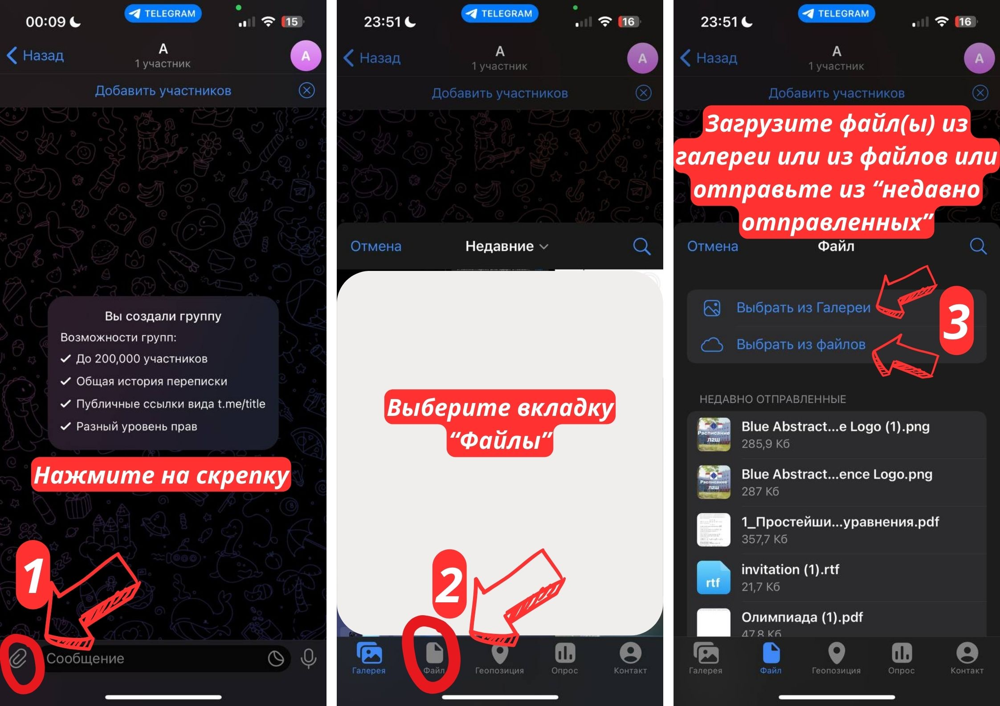

 Welcome to the ReadMe file for our project: Telegram Bot for School Schedule! 📚🤖

Overview 🌀
-----------

Our project is a Telegram bot that allows students and teachers to easily access and manage their school schedules. The bot enables users to view their personalized timetables, receive notifications about upcoming classes, and even request additional lessons. Moreover, it provides an intuitive interface for teachers to create and share new schedules, make changes and send important announcements to their students.

Features 🎉
---------

### Student Features

* View personalized schedule for the day/week
* Receive notifications about changes in lessons
* Receive notifications from school administration
* Easy-to-use interface for setting up a schedule

### Teacher Features

* Create and share new schedules with ease
* Make changes to existing schedules
* Send important announcements to students

Getting Started 🚀
---------------

To get started with the bot, follow these simple steps:

1. Join the Telegram group chat by clicking on the link below:
```bash
https://t.me/l2sh_lessons_bot
```
2. Introduce yourself to the bot.
3. Our bot will guide you through a quick setup process to connect your account and grant necessary permissions.
4. Once set up, you can start interacting with the bot using simple commands



Team of Developers 👨‍💻
---------------
[Nikita](https://t.me/delikatny_pon) - Full Stack developer, Team Leader

[Matthew](https://t.me/lokisf8) - Full Stack developer, Infosec Developer
